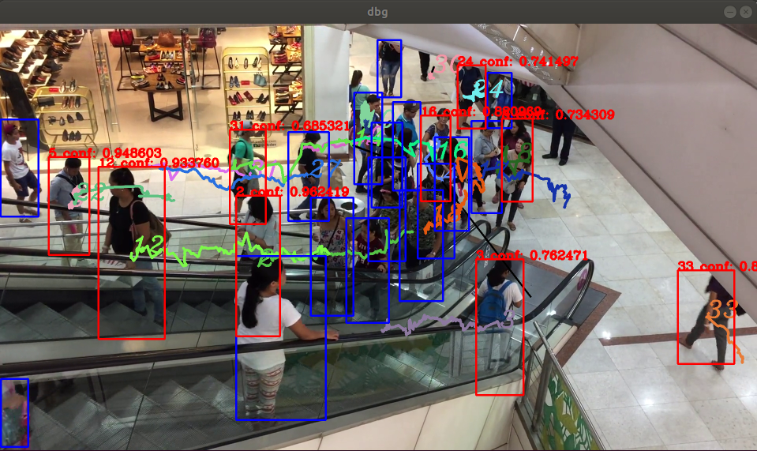

# OpenVINO Demos

OpenVINO includes several [demo applications](https://docs.openvinotoolkit.org/latest/_demos_README.html) that shows how to use the Inference Engine for specific use cases. Here you will find how to run these applications in a Docker Container.

## Build the Docker images

```bash
docker-compose build
```

This will generate the following images:

```bash
pedestrian-tracker-dev              latest              6760f78b93f5        7 minutes ago       1.34GB
```

### Pedestrian Tracker C++ Demo

This demo showcases Pedestrian Tracking scenario: it reads frames from an input video sequence, detects pedestrians in the frames, and builds trajectories of movement of the pedestrians. For more information read the [OpenVINO Pedestrian Tracker documentation.](https://docs.openvinotoolkit.org/latest/_demos_pedestrian_tracker_demo_README.html)

#### Video

The demo is expecting a video in video/video.mp4, so you can place your own video or use download the following public video of a mall:
https://www.pexels.com/video/a-day-at-the-mall-1338598/

#### Run the sample

Since this sample application uses the display to show the output, we need to share the host display with the guest container.

The X server on the host should be enabled for remote connections:

```bash
xhost +
```

Now you can run the sample:

```bash
docker-compose run -rm pedestrian-tracker
```

The sample should display the video with the detections on it:



#### Customizations

Note that the container runs the script pedestrian-tracker.sh which executes the demo with a set of arguments:

```bash

VIDEO="${VIDEO:-/app/videos/video.mp4}"

source /opt/intel/openvino/bin/setupvars.sh && \
    /root/omz_demos_build/intel64/Release/pedestrian_tracker_demo \
  -i $VIDEO \
  -m_det /app/models/intel/person-detection-retail-0013/FP32/person-detection-retail-0013.xml \
  -m_reid /app/models/intel/person-reidentification-retail-0031/FP32/person-reidentification-retail-0031.xml  \
  -d_det CPU
```

You can update the video used by setting the VIDEO environment variariable when running the docker-compose:

```bash
VIDEO=/app/videos/video1.mp4 docker-compose run pedestrian-tracker
```

You can also point to an online video stream.

...

More Demos to come.
